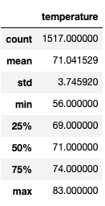
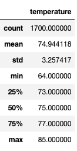
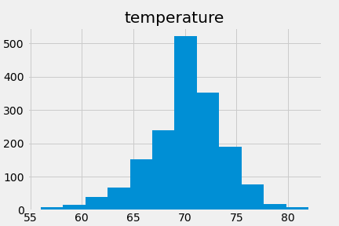
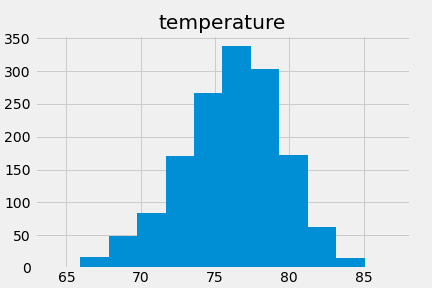

# Surfs Up

## Project Overview
This project aims to determine the suitability to establish a store that will sell surfboards and ice cream to tourists and locals in Hawaii. To launch the Surf n’ Shake shop, we need investors and a business plan. W. Avy is a famous surfer who could be interested in investing, but we need to provide sound research that will show him that this business idea is foolproof. To do this, we need to perform some weather statistical analysis to determine weather patterns in the city of Oahu where we intend to open our Surf n’ Shake shop.

## Challenge
___________________

For this analysis, I worked with an SQLite database and used SQL Alchemy to query the database using Python. 

The purpose of analyzing June’s and December’s temperature data was to identify the differences between them. This analysis can be used to inform our investors if there are any weeks or specific days where the temperature has been historically above or below the average. 

The following bullet points are some of our findings.

-	Mean temperatures in both months are just a few degrees apart, with only a couple of degrees colder in December.
-	Maximum temperatures in both months are similar as well, also a couple of degrees colder in December. These differences in temperature would be almost unnoticeable to people visiting Oahu during these months.
-	Recorded minimum temperatures in December are significantly lower than those in June. There’s an 8-degree difference between them. 

However, we can analyze further to possibly identify any specific days or weeks where low temperatures were recorded. 

### December summary statistics

### June summary statistics

## Summary

The summary statistics suggest that even though the difference between summer and winter might be more noticeable in other parts of the world, in Oahu these two seasons are very similar to one another in terms of weather. Therefore, this can be a desired destination for tourists who would like to experience warmer winters and who could potentially become our customers. 

I performed additional queries to observe the weather patterns year-round. To do this, I calculated summary statistics for both March and September and plotted the data into histograms.  We can observe that there are no significant differences between the analysis in June and December and the one performed for March and September. This suggests that weather temperature is not a factor that will determine the success or failure of this venture. In the following histograms, we can observe that temperatures in March fluctuate between 70 and 75 degrees, and in September they fluctuate between 70 and 80 degrees. 

### March Histogram

### September Histogram

I also did another query to observe specific days in December where temperatures lower than 65 degrees were recorded.  This query was performed to see if it would be advisable to possibly close the shop during this month.  The query results showed that only 80 days in all the years combined for the month of December recorded such temperatures.  Next, I needed to find out for how many years we had weather data. To know that I built another query to get only the year from all dates. I then converted all the years to a Data Frame and dropped duplicates to see the distinct years. After doing this, I found that we had data for the years 2010 to 2017. This shows that only 80 days in the month of December across 8 years had temperatures lower than 65 degrees; this is an average of 10 days a year in the month of December.  That suggests that it might not be worth closing the shop because the result doesn’t seem significant. 

To conclude, opening this Surf n’ Shake shop in Oahu is a good idea. The statistical analysis backs up the business plan that will be presented to the investors. 
